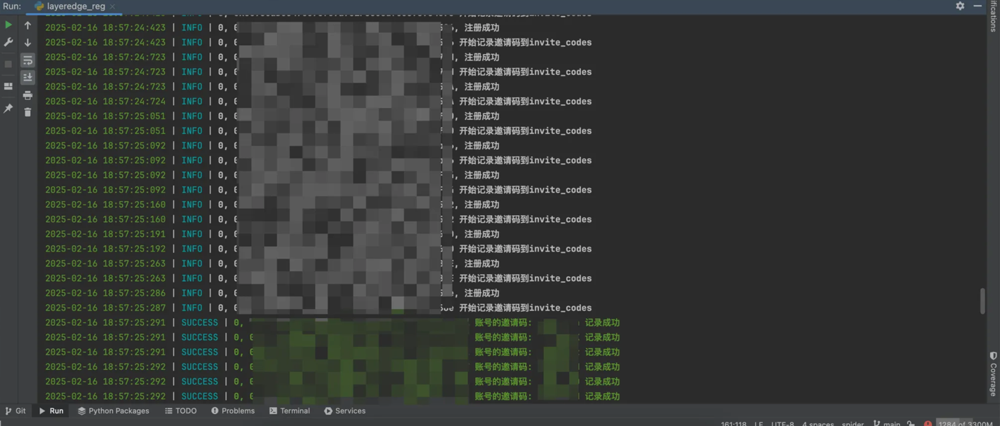

# ILSH LAYER_EDGE 交互脚本

## 注意事项

⚠️ 重要安全提示：

1. 代理配置需使用可靠的服务商
2. 钱包信息请妥善保管
3. 建议在隔离环境运行脚本

## 社区支持

💬 空投信息、脚本频道：[Telegram频道](https://t.me/ilsh_auto)
🐦 最新更新：[X官方账号](https://x.com/hashlmBrian)
🚀 AI交互自动化工具

## 功能特点
- 自动签到
- 账号注册、邀请
- 自动启停节点

## 效果展示
注册

节点运行

## 安装说明

！！先启动JS、再启动Python
* 出现问题请先使用deepseek、chatgpt询问

### js部分

用于生成钱包签名，使用webstorm或者命令行启动

1. 初始化
   cd js_server
   npm init -y
2. 安装依赖
   npm install express@4.18.2 body-parser@1.20.2 ethers@6.7.1 socks-proxy-agent@8.0.2 dotenv@16.3.1
3. 启动服务
   webstorm直接启动即可。
   命令行：
   npm run dev

### python部分

用于layeredge交互

#### 注册
* main_acc 、 invitee_acc 文件格式：助记词----socks5代理

1. 安装依赖包：
   pip install -r requirements.txt
2. 进入reg文件夹，填写main_acc、invitee_acc。
    * main_acc注册成功后会生成邀请码。invitee_acc注册时会使用这些邀请码。
3. 执行python layeredge_reg.py, 需要选择注册的模式，
    * 填入数字1：注册main_acc, 填入数字2：注册invitee_acc的账号。

#### 节点运行
* 若使用注册代码，账号会自动放到acc文件，ps：若有重复，需要自己去重。
1. 将账号添加到acc文件 格式同main_acc一致。
2. 填写完毕后执行：python layeredge_auto.py

## 注意事项
* 节点分数并不是实时更新，需要停止节点再启动才会获得最新分数，我的代码中已经做了处理，任务轮询100次后自动启停

## 支持开发

☕ 如果您觉得这个工具有帮助，可以通过发送 USDT 来支持开发:

- 网络: TRC20
- 地址: `TAiGnbo2isJYvPmNuJ4t5kAyvZPvAmBLch`

赏我一个star吧